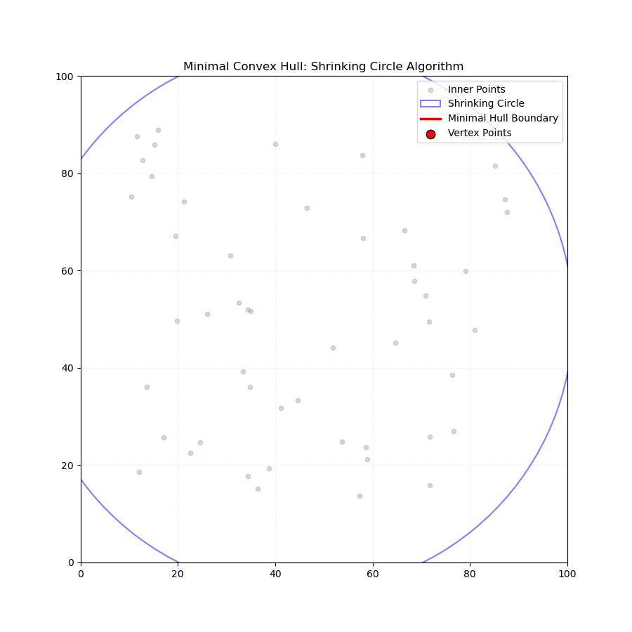

# Shrinking Circle: Minimal Convex Hull Algorithm

[EN] This project implements an intuitive approach to determining the Convex Hull (the smallest convex shape that encloses all points) of a point cloud. The algorithm is based on a "shrinking circle" logic that captures only the true vertex points as it contracts from the outside in.

[TR] Bu proje, bir nokta bulutunun dış çeperini (Convex Hull - tüm noktaları içine alan en küçük dışbükey şekil) belirlemek için geliştirilmiş sezgisel bir yaklaşımı içermektedir. Algoritma, dışarıdan içeriye doğru daralan bir dairenin sadece gerçek köşe noktalarına (vertices) çarparak onları "yakalaması" mantığına dayanır.

---

## 🛠️ How it Works? / Nasıl Çalışır?

### [EN] Algorithm Steps:
1. **Centroid Calculation:** The geometric center (mean) of the point cloud is determined as the anchor point.
2. **Initial Boundary:** A circle starts from the outside, with a radius large enough to encompass all points.
3. **Shrinking Phase:** The radius of the circle is gradually decreased toward the center.
4. **Vertex Capture:** As the circle shrinks, it only "captures" points that are pre-identified as true Convex Hull vertices.
5. **Boundary Formation:** All captured points are sorted by their polar angles to draw a clean, minimal boundary line.

### [TR] Algoritma Adımları:
1. **Merkez Hesaplama:** Nokta bulutunun geometrik merkezi (ortalama) odak noktası olarak belirlenir.
2. **Başlangıç Sınırı:** Tüm noktaları içine alacak kadar büyük bir yarıçapla dışarıdan bir daire başlatılır.
3. **Daralma Aşaması:** Dairenin yarıçapı merkeze doğru kademeli olarak azaltılır.
4. **Köşe Yakalama:** Daire daraldıkça, sadece gerçek "Convex Hull" köşesi olduğu önceden belirlenen noktaları "yakalar".
5. **Sınır Oluşturma:** Yakalanan tüm noktalar kutupsal açılarına göre sıralanarak temiz ve minimal bir dış çeper çizgisi oluşturulur.

--

## 📸 Animation / Animasyon



**[EN]** *The blue circle represents the shrinking boundary, and red dots represent the captured vertices.*
**[TR]** *Mavi daire daralan sınırı, kırmızı noktalar ise yakalanan köşe noktalarını temsil eder.*

---

## 📊 Technical Analysis / Teknik Analiz

### [EN] Time Complexity
- **Centroid Calculation:** $O(n)$
- **Polar Coordinate Conversion & Sorting:** $O(n \log n)$ - *This is the primary bottleneck.*
- **Linear Scan (Minimalization):** $O(n)$
- **Total Complexity:** **$O(n \log n)$**

### [TR] Zaman Karmaşıklığı
- **Merkez Hesaplama:** $O(n)$
- **Polar Koordinat Dönüşümü ve Sıralama:** $O(n \log n)$ - *Algoritmanın ana darboğazıdır.*
- **Lineer Tarama (Minimalizasyon):** $O(n)$
- **Toplam Karmaşıklık:** **$O(n \log n)$**

---

## ⚔️ Comparison: Shrinking Circle vs. QuickHull

| Feature / Özellik | Shrinking Circle (This) | QuickHull |
| :--- | :--- | :--- |
| **Average Case** | $O(n \log n)$ | $O(n \log n)$ |
| **Worst Case** | $O(n \log n)$ (Stable) | $O(n^2)$ (Unstable) |
| **Logic / Mantık** | Radial Sweep & Sort / Radyal Tarama ve Sıralama | Divide and Conquer / Böl ve Yönet |
| **Best For / En İyi Kullanım** | Uniformly distributed clouds / Homojen dağılımlı bulutlar | Large, random datasets / Büyük, rastgele veri setleri |

**[EN]** While QuickHull is often faster in practice for 3D space, the Shrinking Circle approach (similar to Graham Scan logic) provides a more stable $O(n \log n)$ performance in 2D, especially for visualization and radial analysis.

**[TR]** QuickHull pratikte 3D uzayda genellikle daha hızlı olsa da, Daralan Daire yaklaşımı (Graham Scan mantığına benzer) 2D düzlemde, özellikle görselleştirme ve radyal analizler için daha kararlı bir $O(n \log n)$ performansı sunar.

---


## 💻 Usage / Kullanım

### [EN] Requirements / [TR] Gereksinimler
```bash
pip install numpy matplotlib scipy pillow
```

### [EN] Running the Animation / [TR] Animasyonu Çalıştırma
```bash
python src/animation_minimal.py
```

### [EN] Testing the Core Algorithm / [TR] Algoritma Çekirdeğini Test Etme
```bash
python src/minimal_hull_algorithm.py
```

## ✅ Test Results / Test Sonuçları

### [EN] Unit Tests
All 25 test cases passed successfully, covering edge cases, geometric properties, and numerical stability.

### [TR] Birim Testler
Kenar durumları, geometrik özellikler ve sayısal kararlılığı kapsayan 25 test senaryosunun tamamı başarıyla tamamlandı.

```text
============================ test session starts =============================
platform linux -- Python 3.14.4, pytest-9.0.3, pluggy-1.6.0
rootdir: /home/tnc4y/projects/shrinking-circle-hull
plugins: anyio-4.13.0
collected 25 items                                                           

tests/test_minimal_hull_algorithm.py .........................         [100%]

============================= 25 passed in 0.11s =============================
```

---

## 📂 Project Structure / Proje Yapısı

```text
shrinking-circle-hull/
├── assets/
│   └── minimal_hull.gif       # Main animation file
├── src/
│   ├── animation_minimal.py   # Visualization script
│   └── minimal_hull_algorithm.py # Pure Python logic
├── requirements.txt           
└── README.md                  
```

---
*Developed for visualizing geometric algorithms with intuitive animations.*
*Geometrik algoritmaları sezgisel animasyonlarla görselleştirmek amacıyla geliştirilmiştir.*
